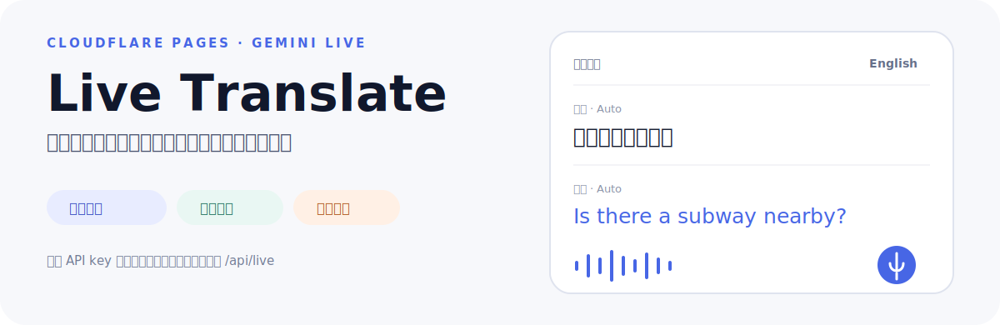

<p align="center">
  
</p>

# Live Translate

一个免安装的网页翻译应用：浏览器采集麦克风音频，通过同源 `/api/live` WebSocket 连接 Cloudflare，再由服务端创建短期凭据并桥接 Gemini Live。界面同时提供双向语音翻译、只显示字幕的文字模式、键入翻译、拍照翻译与本机会话记录。

## 代码中已经存在的产品路径

- **同声传译**：为会话双方分别建立目标语言通道，播放译音并展示输入/输出字幕。
- **文字翻译**：复用实时音频识别，但不播放翻译语音；也可直接键入文字。
- **拍照翻译**：浏览器压缩图片后调用 `/api/translate-image`，提取并翻译可读文字。
- **语言选择**：中文简/繁体加多种对方语言；选择保存在浏览器 `localStorage`。
- **会话记录**：最多保留本地历史，并支持复制、分享、下载与删除。
- **移动端音频处理**：浏览器降噪、40 ms 音频帧、自适应门限；iOS 与常见内置浏览器另有回声门控。
- **运维指标**：D1 保存会话、延迟、错误与设备等事件，`/admin/` 通过 `ADMIN_TOKEN` 查看。

> Gemini 模型名在代码中固定为 `gemini-3.5-live-translate-preview`，文字/图片路径固定为 `gemini-3.5-flash`。两者都是外部服务能力；可用地区、配额、价格与 preview 生命周期以你的 Google 账户实际响应为准。

## 本地启动

需要 Node.js 22+（见 `.node-version`）和 npm：

```bash
npm ci
printf 'GEMINI_API_KEY="your_key"\n' > .dev.vars
npm run dev
```

打开 Wrangler 输出的地址，选择语言与模式，再点击“开始”。浏览器只会在开始实时翻译时请求麦克风权限。

构建 Pages Functions：

```bash
npm run check
```

本地/边缘环境没有 `GEMINI_RELAY` binding 时，`/api/live` 会尝试直接连接 Gemini；如果调用从 Google 不支持的地区发出，这条回退可能失败。

## 请求链

```text
Browser microphone (16 kHz PCM)
      ↓ same-origin WebSocket
Cloudflare Pages Function /api/live
      ↓ preferred
GeminiRelay Durable Object (North America location hint)
      ↓ short-lived token + constrained Live session
Gemini Live Translate
      ↓
captions + translated audio → browser
```

文字与拍照翻译走普通 HTTPS Functions；长期 `GEMINI_API_KEY` 只在 Cloudflare 环境中读取，不返回给浏览器。`/api/token` 仍存在短期 token endpoint，但主界面当前使用 `/api/live` 同源桥接。

## 生产部署

完整部署由两个 Cloudflare 项目组成。

### 1. 部署 Durable Object relay

```bash
cd relay-worker
npm ci
npx wrangler deploy
cd ..
```

`relay-worker/wrangler.toml` 声明 `GeminiRelay` 与 SQLite-backed Durable Object migration。Pages 项目中的 `GEMINI_RELAY` binding 通过 `script_name = "gemini-us-relay"` 指向它。

### 2. 配置 Pages 数据与 secrets

```bash
npx wrangler d1 create gemini-live-translate-metrics
# 把返回的 database_id 写入 wrangler.toml 后：
npm run db:migrate

npx wrangler pages secret put GEMINI_API_KEY --project-name gemini-live-translate
npx wrangler pages secret put ADMIN_TOKEN --project-name gemini-live-translate
npm run deploy
```

也可以使用带版本标记的脚本，它会改写前端 cache-busting tag 与 `public/version.json` 后部署：

```bash
./deploy.sh 20260714-release1
```

这条脚本会修改仓库文件；只在准备提交对应版本变更时使用。

## 数据与隐私边界

- 长期 Gemini key 保存在 Pages secret；不要放进前端、Git、截图或普通 plaintext variable。
- 会话历史保存在浏览器 `localStorage`，最多 30 个会话；存储空间不足时会回退保留最近 10 个。
- `/api/metrics` 的普通指标会过滤常见 token、audio、text 与 transcript 字段。
- **当前诊断实现是例外**：前端会发送 `audio_trace`，也会把字幕片段作为 `transcript_segment.content` 发到 D1；服务端对这两类事件有专门保留逻辑。部署者不能声称“绝不保存聊天内容”，除非删除/禁用这条诊断上报并清理已有数据。
- 管理接口只用共享 `ADMIN_TOKEN` 保护；生产环境应设置高强度 secret、限制访问来源并配置 D1 保留/删除策略。
- 照片会以 base64 发送给服务端 Gemini API；上传前应取得同意并避免敏感文件。

## API 速览

| 路径 | 方法 | 用途 |
|---|---|---|
| `/api/live` | WebSocket GET | 实时语音通道，优先走 Durable Object relay |
| `/api/token` | POST | 创建受约束、单次使用的短期 Live token |
| `/api/translate-text` | POST | 最多 2,000 字符的文字翻译 |
| `/api/translate-image` | POST | 图片 OCR + 双向翻译 |
| `/api/resolve-languages` | POST | 从自然语言描述解析两种语言 |
| `/api/metrics` | POST / GET | 写入指标 / 管理员读取聚合数据 |
| `/admin/` | page | 受 token 保护的运维面板 |

## 代码导航

```text
public/index.html             产品界面
public/app.js                 实时音频、语言、字幕、历史与翻译交互
public/audio-worklets/        麦克风帧采集
functions/api/live.js         Pages WebSocket bridge 与 relay 路由
functions/api/translate-*.js  文字与图片翻译
functions/api/metrics.js      D1 指标写入和管理员查询
relay-worker/src/index.js     固定区域的 Durable Object Gemini bridge
migrations/0001_metrics.sql   指标 schema
public/admin/                 运维面板
```

## License

`package.json` 标记为 private，仓库当前没有许可证文件。不要假定代码可自由再分发；Gemini 与 Cloudflare 的服务使用还受各自条款约束。
